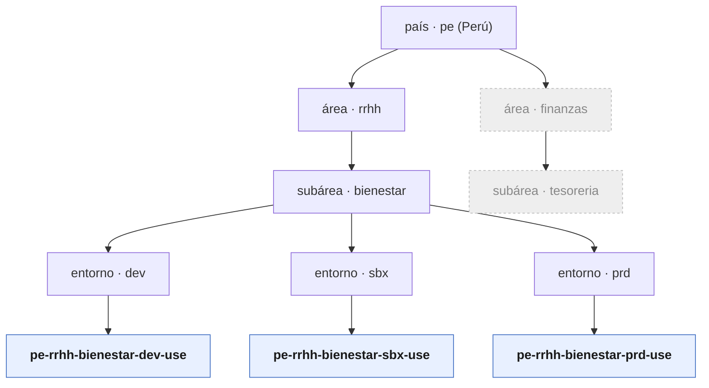

# Framework Power Platform — Qroma

> Base / manifiesto para construir Power Apps (y en general soluciones Power Platform) de forma estandarizada en Qroma. Documento vivo: se construye **por partes**. Estado: **borrador**.

## Índice

1. [Nomenclatura](#1-nomenclatura) ← _definido_
2. Estructura de solución (solutions, publisher prefix) — _pendiente_
3. Ciclo de vida / ALM (dev → sbx → prd) — _pendiente_
4. Seguridad y grupos Entra por entorno — _pendiente_
5. Conectores permitidos y DLP — _pendiente_
6. Convenciones internas de la app (pantallas, controles, variables) — _pendiente_

---

## 1. Nomenclatura

### 1.1 Patrón

Todo **entorno** (environment) se nombra con 5 segmentos:

```
pais-area-subarea-entorno-region
```

Ejemplo canónico:

```
pe-rrhh-bienestar-prd-use
```

### 1.2 Reglas

- **Todo en minúsculas.** (Aunque el cliente lo compartió en mayúsculas, el estándar es minúscula.)
- **Separador `-`** entre segmentos. Por lo tanto **cada segmento es UN solo token**: sin espacios, sin `-` interno, sin `_`.
- Caracteres válidos por segmento: `[a-z0-9]`. **Sin acentos ni ñ** (ej. `logistica`, no `logística`).
- Orden **fijo**: país → área → subárea → entorno → región. No se omiten segmentos.
- Palabra de 2+ palabras (ej. "bienestar social") → se **compacta o abrevia** a un token y se registra en el vocabulario controlado (§1.3). No se permite meter la segunda palabra como otro segmento.
- Validación (regex): `^[a-z]{2}-[a-z0-9]+-[a-z0-9]+-(prd|sbx|dev)-[a-z0-9]+$`

### 1.3 Vocabulario controlado por segmento

Cada segmento tiene una lista cerrada de valores. Agregar un valor nuevo = actualizar esta tabla (control de cambios).

| Segmento | Qué es | Valores conocidos | Regla |
|---|---|---|---|
| **país** | País de la unidad de negocio | `pe` = Perú · `cl` = Chile | 2 letras, ISO 3166-1 alpha-2 |
| **área** | Área / gerencia dueña | `rrhh` · `finanzas` | token corto, estable |
| **subárea** | Sub-área dentro del área | ver catálogo §1.3.1 | token corto, único dentro del área |
| **entorno** | Etapa del ciclo de vida | `prd` (Producción) · `sbx` (Sandbox) · `dev` (Developer) | **fijo**, mapea 1:1 al tipo de environment de Power Platform |
| **región** | Región de despliegue (datacenter) | `use` = Estados Unidos (Este) | acrónimo de región; `use` es el caso más común |

Mapeo de `entorno` al tipo real de Power Platform:

| código | tipo de environment | uso |
|---|---|---|
| `prd` | Production (Managed) | operación real, cambios controlados |
| `sbx` | Sandbox | pruebas de integración / QA, copia de prod |
| `dev` | Developer | desarrollo individual del maker |

#### 1.3.1 Catálogo de subáreas

El nombre de negocio suele tener 2+ palabras; el **token** es su forma corta para el nombre del entorno. El token debe ser **único dentro de su área**. Se amplía a medida que se sumen subáreas.

| Área | Subárea (nombre de negocio) | token |
|---|---|---|
| `rrhh` | Bienestar Social | `bienestar` |
| `rrhh` | _(pendiente)_ | _(pendiente)_ |
| `finanzas` | _(pendiente)_ | _(pendiente)_ |

> Regla de token: minúsculas, `[a-z0-9]`, sin espacios ni acentos. Si dos subáreas colisionan en el token corto, se desambigua (ej. `bienestar` vs `bienestarlab`).

### 1.4 Ejemplos

| Nombre | Lectura |
|---|---|
| `pe-rrhh-bienestar-prd-use` | Perú · RRHH · Bienestar · Producción · US-Este |
| `pe-rrhh-bienestar-sbx-use` | mismo, pero Sandbox |
| `pe-rrhh-bienestar-dev-use` | mismo, pero Developer |
| `pe-finanzas-tesoreria-prd-use` | Perú · Finanzas · Tesorería · Producción · US-Este |
| `cl-rrhh-bienestar-prd-use` | Chile · RRHH · Bienestar · Producción · US-Este |

### 1.5 Caso de la jerarquía (diagrama)

Un país agrupa áreas; un área agrupa subáreas; cada subárea se despliega en los 3 entornos (dev/sbx/prd); la región cierra el nombre.



Región (`use`) va como sufijo, no como nivel del árbol: es *dónde* se despliega, no *qué* unidad de negocio es.

### 1.6 Alcance de la convención

El nombre del entorno es la raíz. La misma convención **siembra** los nombres de artefactos asociados (se detallará en §4):

- Security group Entra del entorno → `sg-pe-rrhh-bienestar-prd`
- Política DLP → `dlp-pe-rrhh-...`
- Publisher prefix de solución → derivado del área (ej. `qrh` para rrhh)

### 1.7 Decisiones

Resueltas:

- **D1 — país Chile → `cl`** (ISO 3166-1 alpha-2; se descarta `ch`, que es Suiza).
- **D2 — subárea "Bienestar Social" → `bienestar`.** Catálogo extensible en §1.3.1.

Pendientes:

- **D3 — separador vs. entornos actuales.** El único entorno gestionado hoy se llama `PE_RRHH_BIENESTAR_PRD_US` (usa `_` y `US`). El estándar nuevo usa `-` y `use` → quedaría `pe-rrhh-bienestar-prd-use`. Definir plan de renombre para alinearlo (el display name se puede cambiar).
- **D4 — catálogo de regiones.** Formalizar acrónimos además de `use` (ej. si aparece Brasil, Europa). Confirmar que `use` = "East US" de Azure.

> Próxima parte sugerida: §4 (grupos Entra por entorno), porque conecta directo con el hallazgo del assessment — 14 entornos sin security group.
