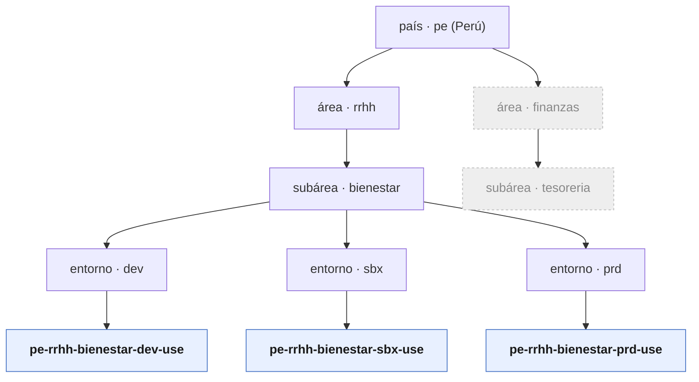
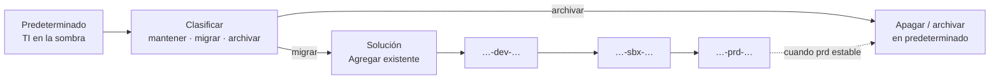
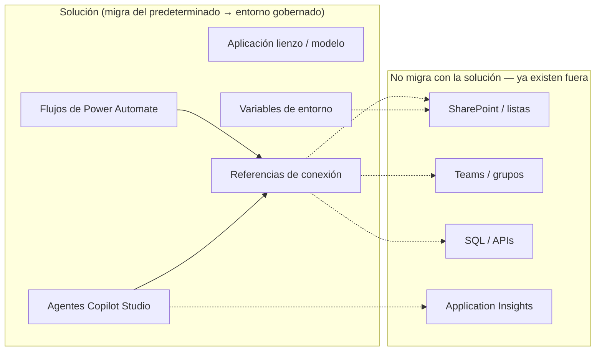
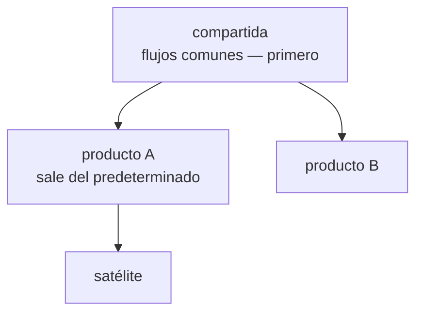
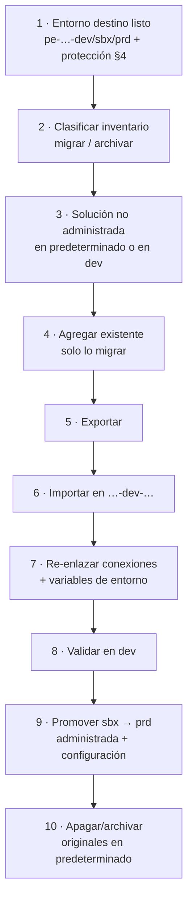
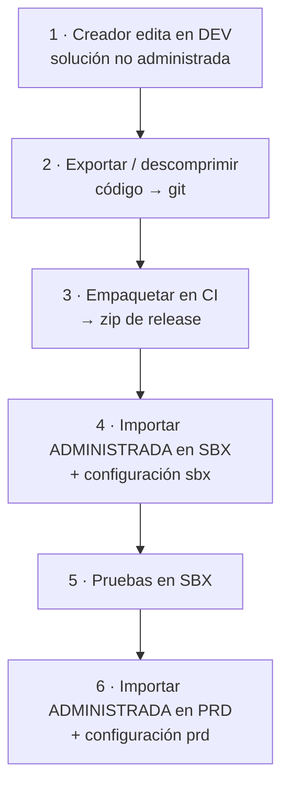
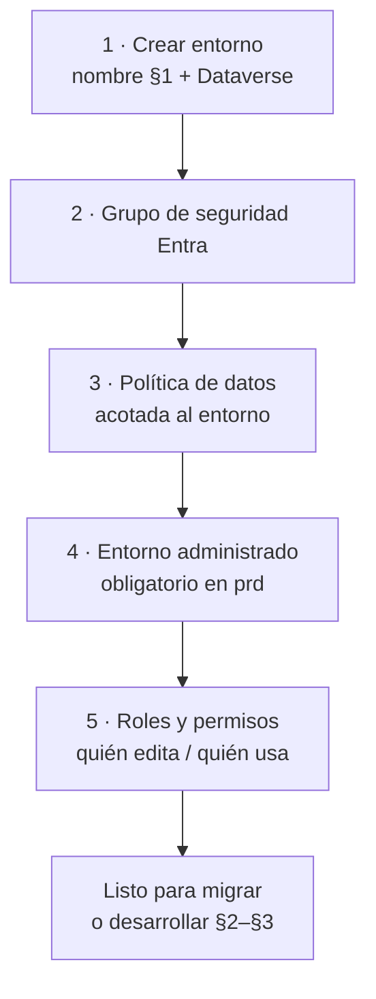
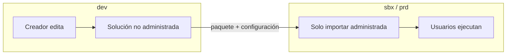

# Framework Power Platform — Qroma

> Base / manifiesto para construir Power Apps (y en general cargas Power Platform) de forma estandarizada en Qroma. Documento vivo: se construye **por partes**. Estado: **borrador**.

## Índice

1. [Nomenclatura](#1-nomenclatura)
2. [Soluciones](#2-soluciones)
3. [Ciclo de vida](#3-ciclo-de-vida)
4. [Protección del entorno](#4-protección-del-entorno)
5. TODO: Catálogo de conectores
6. TODO: Convenciones internas de la app (pantallas, controles, variables)

---

## 1. Nomenclatura

### 1.1 Patrón

Todo **entorno** se nombra con 5 segmentos:

```
pais-area-subarea-entorno-region
```

Ejemplo canónico:

```
pe-rrhh-bienestar-prd-use
```

### 1.2 Reglas

- **Todo en minúsculas.** (Aunque el cliente lo compartió en mayúsculas, el estándar es minúscula.)
- **Separador `-`** entre segmentos. Por lo tanto **cada segmento es UN solo token**: sin espacios, sin `-` interno, sin `_`.
- Caracteres válidos por segmento: `[a-z0-9]`. **Sin acentos ni ñ** (ej. `logistica`, no `logística`).
- Orden **fijo**: país → área → subárea → entorno → región. No se omiten segmentos.
- Palabra de 2+ palabras (ej. "bienestar social") → se **compacta o abrevia** a un token y se registra en el vocabulario controlado (§1.3). No se permite meter la segunda palabra como otro segmento.
- Validación (expresión regular): `^[a-z]{2}-[a-z0-9]+-[a-z0-9]+-(prd|sbx|dev)-[a-z0-9]+$`

### 1.3 Vocabulario controlado por segmento

Cada segmento tiene una lista cerrada de valores. Agregar un valor nuevo = actualizar esta tabla (control de cambios).

| Segmento | Qué es | Valores conocidos | Regla |
|---|---|---|---|
| **país** | País de la unidad de negocio | `pe` = Perú · `cl` = Chile | 2 letras, ISO 3166-1 alpha-2 |
| **área** | Área / gerencia dueña | `rrhh` · `finanzas` | token corto, estable |
| **subárea** | Sub-área dentro del área | ver catálogo §1.3.1 | token corto, único dentro del área |
| **entorno** | Etapa del ciclo de vida | `prd` (producción) · `sbx` (pruebas) · `dev` (desarrollo) | **fijo**, mapea 1:1 al tipo de entorno de Power Platform |
| **región** | Región de despliegue (centro de datos) | `use` = Estados Unidos (Este) | acrónimo de región; `use` es el caso más común |

Mapeo de `entorno` al tipo real de Power Platform:

| código | tipo de entorno | uso |
|---|---|---|
| `prd` | Production (entorno administrado) | operación real, cambios controlados |
| `sbx` | Sandbox | pruebas de integración / aceptación |
| `dev` | Developer | desarrollo del creador |

#### 1.3.1 Catálogo de subáreas

El nombre de negocio suele tener 2+ palabras; el **token** es su forma corta para el nombre del entorno. El token debe ser **único dentro de su área**. Se amplía a medida que se sumen subáreas.

| Área | Subárea (nombre de negocio) | token |
|---|---|---|
| `rrhh` | Bienestar Social | `bienestar` |
| `rrhh` | _(pendiente)_ | _(pendiente)_ |
| `finanzas` | _(pendiente)_ | _(pendiente)_ |

> Regla de token: minúsculas, `[a-z0-9]`, sin espacios ni acentos. Si dos subáreas colisionan en el token corto, se desambigua (ej. `bienestar` vs `bienestarlab`).

### 1.4 Ejemplos

| Nombre | Lectura |
|---|---|
| `pe-rrhh-bienestar-prd-use` | Perú · RRHH · Bienestar · Producción · US-Este |
| `pe-rrhh-bienestar-sbx-use` | mismo, pero pruebas |
| `pe-rrhh-bienestar-dev-use` | mismo, pero desarrollo |
| `pe-finanzas-tesoreria-prd-use` | Perú · Finanzas · Tesorería · Producción · US-Este |
| `cl-rrhh-bienestar-prd-use` | Chile · RRHH · Bienestar · Producción · US-Este |

### 1.5 Jerarquía

Un país agrupa áreas; un área agrupa subáreas; cada subárea se despliega en los 3 entornos (dev/sbx/prd); la región cierra el nombre.



Región (`use`) va como sufijo, no como nivel del árbol: es *dónde* se despliega, no *qué* unidad de negocio es.

### 1.6 Alcance de la convención

El nombre del entorno es la raíz. La misma convención **siembra** los nombres de artefactos asociados (§4):

- Grupo de seguridad Entra del entorno → `sg-pe-rrhh-bienestar-prd`
- Política de prevención de pérdida de datos → `dlp-pe-rrhh-bienestar-prd`
- Prefijo de publicador de solución → derivado del área (ej. `qrh` para rrhh)

---

## 2. Soluciones

Hoy el trabajo de negocio (aplicaciones, flujos, agentes) está concentrado en el entorno **predeterminado (Default)**: abierto al inquilino, sin grupo de seguridad, sin ciclo de vida. Los entornos gobernados (`pe-…-dev|sbx|prd-…`, §1) son el destino.

La **solución** es el mecanismo oficial para **sacar** ese trabajo del predeterminado e **instalarlo** en los entornos de la subárea. Es el **medio de migración** y, después, de promoción dev → sbx → prd.

> Postura: **nada de negocio nuevo en el predeterminado**. Lo que deba vivir, se clasifica, se empaqueta en solución y se migra a `…-dev-…` (y de ahí a sbx/prd). Lo demás se archiva o se apaga en el predeterminado.



### 2.1 Alcance

| Enfoque | ¿Sirve para salir del predeterminado? |
|---|---|
| **Solución** (exportar / importar) | **Sí** — trae app/flujo/agente + referencias de conexión; repetible hacia sbx/prd |
| Guardar como / clonar flujo | No — rompe propietario, referencias y el ciclo de vida posterior |
| Recrear de cero en dev | Solo si el original es basura o no se puede exportar |
| Dejar en el predeterminado | No — es el problema a resolver |

Migrar **no mueve**: **copia** el componente al destino. El original en el predeterminado **sigue activo** hasta que se apague o archive de forma explícita.

### 2.2 Contenido



En las evaluaciones de Qroma, la mayoría de apps/flujos del predeterminado **no** dependen de tablas Dataverse de negocio: datos en SharePoint/Excel/SQL. Migrar el paquete **no** implica migrar un Dataverse de negocio; el riesgo real es **reconectar las conexiones** (idealmente cuentas de servicio) en el entorno destino.

### 2.3 Clasificación

No se sube el predeterminado entero a dev/prd. Por cada app/flujo/agente (inventarios en `assessments/`):

| Etiqueta | Criterio | Acción |
|---|---|---|
| **migrar** | Uso de negocio real, dueño claro, se seguirá evolucionando | Entra en una solución → importar a `…-dev-…` |
| **mantener (temporal)** | Aún corre en el predeterminado pero hay fecha de apagado | Plan de migrar o archivar; no es estado final |
| **archivar** | Huérfano, duplicado, prueba, sin dueño | Apagar y no empaquetar |

Agrupar lo *migrar* por **producto / proceso de negocio** (una solución por producto, no un paquete monstruo de todo el predeterminado).

### 2.4 Tipos

| Tipo | Rol en la migración | Ejemplo |
|---|---|---|
| **Aplicación / producto** | Unidad que se saca del predeterminado y aterriza en la subárea | `qrh-bienestar-portal`, `qrh-sofia-core` |
| **Satélite** | Módulo del mismo producto (opcional) | `qrh-sofia-procesos`, `qrh-sofia-legal` |
| **Compartida** _(cuando aplique)_ | Flujos comunes de varios productos; migrar/desplegar **antes** que las apps | `qrh-bienestar-shared` |



Orden de importación en cada entorno gobernado: **compartida (si hay) → producto → satélites**.

### 2.5 Publicador y nombre

- **Publicador** por área; prefijo corto. No inventar prefijos por creador.

| Área | Nombre del publicador | **prefijo** |
|---|---|---|
| `rrhh` | Qroma RRHH | `qrh` |
| `finanzas` | Qroma Finanzas | `qfn` _(propuesto)_ |

- Nombre de solución:

```
{prefijo}-{subarea}-{producto}
```

Ejemplos: `qrh-bienestar-portal`, `qrh-sofia-core`.

- En **dev**: solución **no administrada** (se edita tras migrar).
- En **sbx/prd**: solución **administrada** (solo importar; no editar en el portal).

### 2.6 Migración

Empaquetar con **Agregar existente** es benigno: no detiene ni altera la ejecución en el predeterminado.



| Paso | Detalle |
|---|---|
| 1 | Entornos según §1 y **protección completa §4**. Sin destino protegido, no hay migración. |
| 2 | Usar inventarios/evaluaciones; no migrar huérfanos. |
| 3–4 | Una solución por producto. Agregar existente de apps/flujos/agentes *migrar*. |
| 5–6 | Exportar → importar en `…-dev-…`. Aterrizar primero en **dev**, no directo a prd. |
| 7 | Conexiones bajo cuenta de servicio; SharePoint/Teams/SQL se **re-enlazan**, no se copian. |
| 8 | Prueba rápida; dueños y uso compartido vía grupo de seguridad del entorno (§4). |
| 9 | Mismo paquete administrado a sbx y prd (§3). |
| 10 | El predeterminado deja de ser producción de ese producto **solo** cuando prd está estable. |

**No hacer:** Guardar como entre entornos; importar basura sin clasificar; editar en sbx/prd; borrar del predeterminado antes de validar prd.

### 2.7 Lógica compartida

Si varios productos llaman la misma operación (ej. “Cierre de operación” → SharePoint):

- Migrar **un** flujo en solución compartida (o en el primer producto y luego extraer).
- El resto **referencia** (flujo secundario / ejecutar desde la app); no clonar el flujo por app.
- El flujo compartido tiene que ir en solución; si queda en “Mis flujos” suelto en el predeterminado, no hay migración ni referencia estable.

### 2.8 Agentes

Los agentes viven en un **entorno**. Un producto (ej. SofIA: orquestador + sub-agentes + flujos) se migra como el resto:

- Sale del predeterminado (o del entorno actual) en solución(es) del producto.
- Orquestador, sub-agentes y flujos que se invocan entre sí → **mismo entorno** por etapa (`…-dev|sbx|prd-…`).
- SharePoint, Teams, sistemas externos (ej. Goldenbelt), Application Insights → fuera; solo referencias de conexión / configuración.

---

## 3. Ciclo de vida

La migración (§2) pone el producto en **dev**. A partir de ahí, el predeterminado **no** es el origen de cambios: el ciclo es dev → sbx → prd.

### 3.1 Flujo



| Paso | Dónde | Qué |
|---|---|---|
| Editar | `…-dev-…` | Único sitio donde se cambia lógica |
| Origen | Git (solución **descomprimida**) | No versionar el `.zip` de release |
| Empaquetar / desplegar | Integración continua | `pac solution pack` + importar (o recurso Terraform de solución) |
| Cableado | archivo de configuración por entorno | Identificadores de conexión + variables (dev ≠ sbx ≠ prd) |

### 3.2 Artefactos

| Artefacto | Rol |
|---|---|
| **Paquete de solución** (zip o carpeta descomprimida en git) | *Qué* componentes son |
| **Configuración por entorno** (`settings.json` o equivalente) | *Cómo* se cablea en **este** entorno (conexiones, URLs) |

Mismo paquete de release a sbx y prd; cambia la configuración.

### 3.3 Reglas

1. **Origen de verdad tras migrar = dev** (y git), no el predeterminado.
2. **No editar** en sbx/prd (solución administrada). Corrección urgente → dev → redesplegar.
3. **Orden de importación:** compartida (si hay) → producto → satélites.
4. Tras cada importación: verificar conexiones, encender flujos, prueba rápida.
5. **Migrar ≠ apagar:** el predeterminado sigue hasta el paso 10 de §2.6.
6. Trabajo **nuevo** de la subárea: nace en `…-dev-…` dentro de solución; **nunca** en el predeterminado.

---

## 4. Protección del entorno

Crear el entorno (§1) **no basta**. Hasta que no tenga la protección de esta sección, **no es destino válido de migración** ni de trabajo de negocio.

> Un entorno sin grupo de seguridad, sin política de datos y sin control de edición en prd es otro predeterminado con otro nombre.

### 4.1 Checklist al crear

Por cada `pe-…-{dev|sbx|prd}-…` nuevo, en este orden:



| # | Control | dev | sbx | prd |
|---|---|---|---|---|
| 1 | Entorno con nombre canónico + Dataverse | sí | sí | sí |
| 2 | Grupo de seguridad Entra asignado | sí | sí | sí |
| 3 | Política de datos propia (o heredada explícita) | sí | sí | sí |
| 4 | Entorno administrado (Managed Environment) | opcional | recomendado | **obligatorio** |
| 5 | Soluciones administradas (solo importar) | no (aquí se edita) | **sí** | **sí** |
| 6 | Límites de uso compartido de aplicaciones | según necesidad | sí | **sí** |
| 7 | Cuentas de servicio para conexiones de negocio | sí | sí | **sí** |

Sin los puntos 2 y 3, no se importa carga de negocio. Sin 4–6 en prd, no se considera producción.

### 4.2 Grupo de seguridad

- Un grupo Entra **por entorno** (no reutilizar el de otra etapa).
- Nombre: `sg-{pais}-{area}-{subarea}-{entorno}` → ej. `sg-pe-rrhh-bienestar-prd`.
- Se asigna al crear/actualizar el entorno (`security_group_id` en Terraform).
- **Quién entra al grupo:**
  - `dev`: creadores de la subárea + administradores de plataforma.
  - `sbx`: creadores + probadores / negocio para UAT.
  - `prd`: **usuarios de la app** + operadores; **no** todo el equipo de desarrollo “por si acaso”.
- Quien no está en el grupo **no ve** el entorno (a diferencia del predeterminado, abierto al inquilino).
- El predeterminado **no admite** grupo de seguridad (limitación de Microsoft): por eso no es destino de negocio.

### 4.3 Política de datos (DLP)

Cada entorno gobernado lleva una política de prevención de pérdida de datos **con alcance a ese entorno** (no depender solo de la política global del inquilino).

| Aspecto | Estándar |
|---|---|
| Nombre | `dlp-{pais}-{area}-{subarea}-{entorno}` |
| Alcance | Solo ese entorno (`OnlyEnvironments`) |
| Conectores de negocio | Grupo negocio: SharePoint, Dataverse, SQL, Outlook, Teams, etc. (catálogo fino en §5) |
| Conectores personales / riesgo | Bloqueados o grupo no negocio según §5 |
| Conectores nuevos | Por defecto **bloqueados** hasta revisión de administración |
| Personalización | Una política por entorno permite endurecer **prd** sin romper **dev** |

La política global del inquilino (ej. bloqueo de almacenamiento externo de consumidor) sigue como red de seguridad; la de entorno es la que gobierna el día a día de la subárea.

> No apretar la política global del predeterminado hasta migrar lo de negocio: ahí siguen apps que usan Excel/OneDrive/SharePoint/SQL y se romperían.

### 4.4 Entorno administrado y límites de uso compartido

| Control | dev | sbx | prd |
|---|---|---|---|
| Entorno administrado | opcional | recomendado | **obligatorio** |
| Límites al compartir aplicaciones lienzo | flexible | sí | **sí** (sin compartir a grupos amplios / tope de usuarios) |
| Información de uso / cumplimiento | opcional | sí | sí |
| Comprobador de soluciones en importación | aviso | aviso o bloqueo | **aviso o bloqueo** |

Efecto buscado en prd: menos “compartir con media empresa”, visibilidad de uso y fricción deliberada ante cambios no gobernados.

### 4.5 Quién puede editar (sobre todo en prd)

La solución administrada (§2.5, §3) es **una** capa. Hay que reforzarla con permisos del entorno:

| Rol / práctica | dev | sbx | prd |
|---|---|---|---|
| Creador / personalizador del sistema | sí (equipo de la subárea) | limitado (soporte a pruebas) | **no** para el día a día |
| Usuario básico / de aplicación | según prueba | probadores | **usuarios de negocio** |
| Administrador de entorno / sistema | plataforma + líderes técnicos | igual | igual; cambios solo por importación |
| Editar flujos/apps en el portal | permitido | **prohibido** (salvo emergencia documentada) | **prohibido** |
| Cambiar lógica de negocio | solución no administrada + git | — | solo redespliegue desde dev |

Reglas:

1. En **prd** y **sbx** las soluciones llegan **administradas**: el portal no es el editor.
2. Los creadores de la subárea **no** necesitan rol de personalizador en prd; si lo tienen, el proceso igual prohíbe editar ahí.
3. Conexiones de producción: **cuenta de servicio** (o principal de servicio), no el usuario personal del creador.
4. Corrección urgente en prd: se hace en **dev**, se promueve; no se “parchea” el flujo en caliente en prd.
5. El despliegue a prd lo ejecuta integración continua o un operador de plataforma, no cada creador por su cuenta.



### 4.6 Cuentas y conexiones

| Práctica | Motivo |
|---|---|
| Cuenta de servicio por subárea o producto en prd | El flujo no se cae si se va el creador |
| Misma lógica de cuenta en sbx (o cuenta de pruebas dedicada) | Probar el cableado real |
| En dev puede usarse cuenta de creador **solo** para prototipo | Antes de promover: pasar a cuenta de servicio |
| Secretos y contraseñas fuera de git | Configuración de entorno / almacén de secretos de CI |
| Revisar conexiones tras cada importación | El paquete no trae credenciales útiles entre entornos |

### 4.7 Relación con la infraestructura

El arnés se provisiona junto al entorno (hoy en `infrastructure/`, ampliar según roadmap):

| Recurso | Rol en el arnés |
|---|---|
| `powerplatform_environment` | Entorno + grupo de seguridad |
| `powerplatform_managed_environment` | Entorno administrado (prd) |
| `powerplatform_data_loss_prevention_policy` | Política de datos por entorno |
| Roles / membresía de grupos Entra | Fuera o junto a IaC de identidad |
| Importación de solución | Ciclo de vida (§3), no creación del borde |

Crear un entorno = nombre §1 **y** filas de §4.1 cumplidas. Un `terraform apply` que solo deja el entorno vacío **no** cierra el trabajo.

### 4.8 Resumen

| Riesgo | Control |
|---|---|
| Cualquiera del inquilino entra al entorno | Grupo de seguridad Entra |
| Conectores peligrosos o personales | Política de datos por entorno |
| Editar producción a mano | Solución administrada + roles sin personalizador + proceso §3 |
| Compartir la app con toda la empresa | Límites de uso compartido + entorno administrado |
| Flujos atados a una persona | Cuentas de servicio |
| Otro “predeterminado” con nombre bonito | Checklist §4.1 antes de migrar |

> Detalle fino de qué conector va a negocio / no negocio / bloqueado: §5 (catálogo de conectores).
